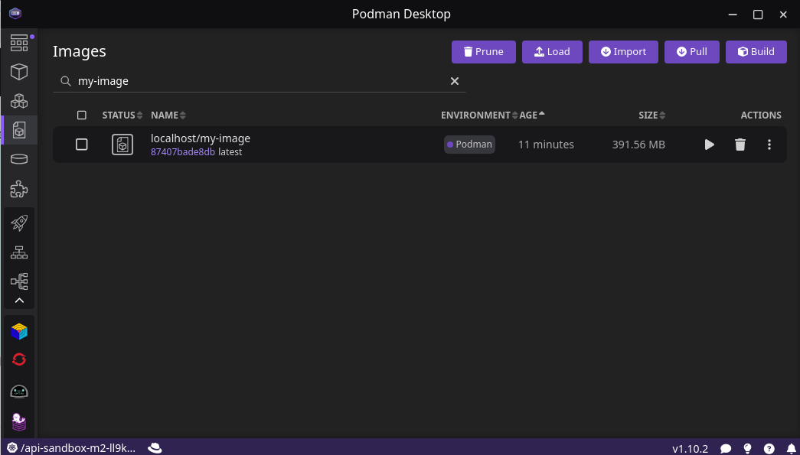

# Image Management

An image can be used to create and run containers. It is like a template, containing instructions on how to build the container. Images are the starting point for any container related activity, and can be thought of as a snapshot in a virtual machine (VM) environment.

---
## Building an image based on a Containerfile (aka Dockerfile)

With the Containerfile that we created in the last step, let’s build a container image:

```bash
podman build -t my-image .
```

You’ll see an output like this:

```text
STEP 1/11: FROM registry.access.redhat.com/ubi9/openjdk-21-runtime:1.18-4
STEP 2/11: ENV LANGUAGE='en_US:en'
--> Using cache 7819ee5ffcddd7271987e306c787854c874bc81798370435d6efa7a89cc4990e
--> 7819ee5ffcdd
STEP 3/11: COPY --chown=185 target/quarkus-app/lib/ /deployments/lib/
--> 9b51381ccca6
STEP 4/11: COPY --chown=185 target/quarkus-app/*.jar /deployments/
--> 4d299e6fd3b4
STEP 5/11: COPY --chown=185 target/quarkus-app/app/ /deployments/app/
--> 6fce0c1e1dbc
STEP 6/11: COPY --chown=185 target/quarkus-app/quarkus/ /deployments/quarkus/
--> 7177bec47b2f
STEP 7/11: EXPOSE 8080
--> 9bd1b9ec7771
STEP 8/11: USER 185
--> 61bc6e589684
STEP 9/11: ENV JAVA_OPTS="-Djava.util.logging.manager=org.jboss.logmanager.LogManager"
--> 08f8fe193e07
STEP 10/11: ENV JAVA_APP_JAR="/deployments/quarkus-run.jar"
--> 2f8f931e08b1
STEP 11/11: CMD ["java", "-jar", "/deployments/app.jar"]
COMMIT my-image
--> a8172ead99ee
Successfully tagged localhost/my-image:latest
a8172ead99eece385fa756e85948656896645f7f1848c68dfe498da9d93be073
```

---
## Listing the available images

To see your just created image, just run:

```bash
podman image list
```

You’ll see at least these two outputs:

```text
REPOSITORY                                   TAG                 IMAGE ID            CREATED             SIZE
my-image                                     latest              87776d35fc85        4 minutes ago       392MB
registry.access.redhat.com/ubi9/openjdk-21-runtime 1.18-4        80786be7434f        3 weeks ago         375 MB
```

Your image is the `my-image` and the `registry.access.redhat.com/ubi9/openjdk-21` is the image used to build yours.

---
## Exploring the Desktop interface

Let’s take a look at image management in the Desktop interfaces.

**Podman Desktop**

With Podman Desktop, we can see our newly created image in the `Images` tab. We can find information about the newly created image, including the the image ID, tag, creation date, and size of the image. Let’s select the image name to see more information about the image.



We can see information about the image layers, and low-level information about the image in JSON format.


For now though, let’s stick to the terminal and get a little more comfortable with the command line instructions.

---
## Managing images

The Podman or Docker CLI offer many ways to manage container images. You can find out more by issuing the following help command:

```bash
podman image -h
```

```text
Manage images

Description:
  Manage images

Usage:
  podman image [command]

Available Commands:
  build       Build an image using instructions from Containerfiles
  diff        Inspect changes to the image's file systems
  exists      Check if an image exists in local storage
  history     Show history of a specified image
  import      Import a tarball to create a filesystem image
  inspect     Display the configuration of an image
  list        List images in local storage
  load        Load image(s) from a tar archive
  mount       Mount an image's root filesystem
  prune       Remove unused images
  pull        Pull an image from a registry
  push        Push an image to a specified destination
  rm          Remove one or more images from local storage
  save        Save image(s) to an archive
  scp         Securely copy images
  search      Search registry for image
  sign        Sign an image
  tag         Add an additional name to a local image
  tree        Print layer hierarchy of an image in a tree format
  trust       Manage container image trust policy
  unmount     Unmount an image's root filesystem
  untag       Remove a name from a local image
```

Let’s try to remove your just created image:

```bash
podman image rm my-image
```

Great! You’re well on your way to becoming a Container Image expert :)
