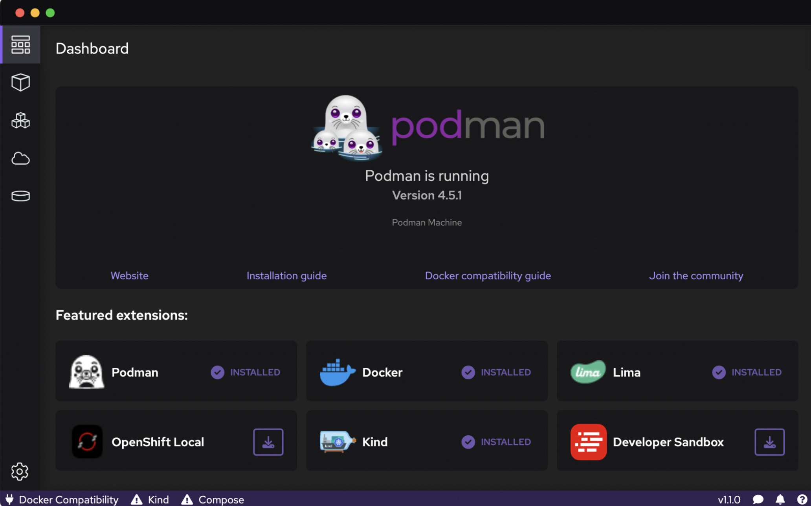
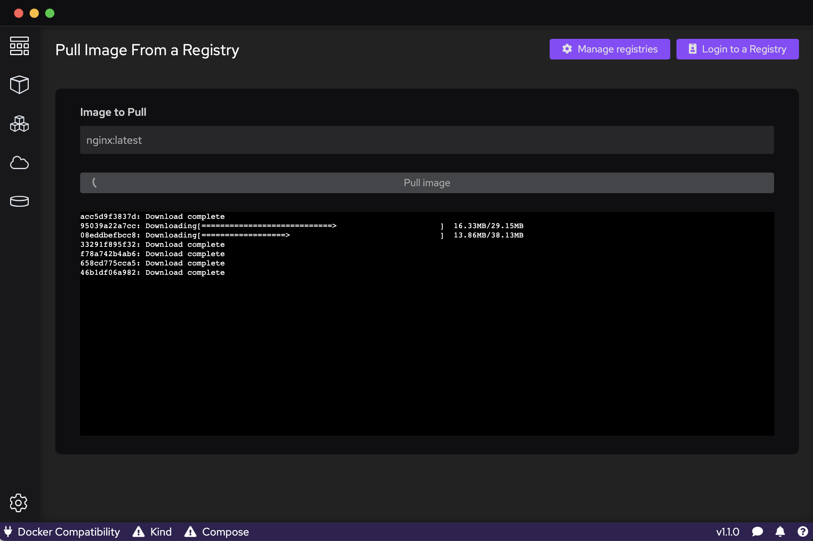
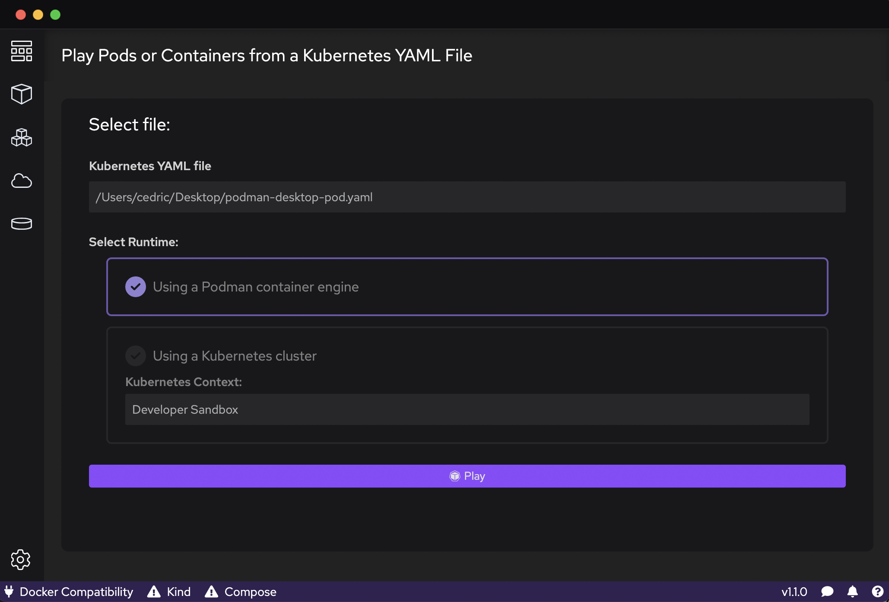

# Introduction to Podman Desktop

[Podman Desktop](https://podman-desktop.io/) is a powerful tool for managing containers and images on your desktop environment. It includes benefits such as running Kubernetes pods, deployment to your Kubernetes and OpenShift clusters, and Docker Desktop extension support. Let’s take a look at some of the features of Podman Desktop and go through some of the basic steps we’ve done in this tutorial, on Podman Desktop.

---
## Podman Desktop Installation

Podman Desktop is available for Linux, macOS, and Windows. You can download the latest version from [podman-desktop.io](https://podman-desktop.io/). The installation process is straightforward and only takes a few minutes to complete.

> **TIP:** For macOS users, you can easily install Podman Desktop using Homebrew. The command is `brew install podman-desktop`.

Once installed, your Podman Desktop dashboard will show the current version of Podman, featured extensions, and a left-hand navigation menu for:

- **Containers:** Create, manage, and delete containers.
- **Pods:** Create and manage pods, as well as play Kubernetes YAML using Podman or a Kubernetes cluster.
- **Images:** Pull, build (via Dockerfile), and manage images.
- **Volumes:** Manage persistent storage for containers.



---
## Image Management

Podman Desktop allows you to pull images from Docker Hub, Quay.io, and other registries. You can also build images from a Dockerfile or Containerfile. For this example, let’s pull the `nginx:latest` image from Docker Hub. In the **Images** tab, click the **Pull an image** button and enter `nginx` in the Image to **Pull** field. Click **Pull image** to start the pull process. The default registry is Docker Hub, but you can add other registries with authentication by selecting **Manage registries**.



---
## Running containers

With the **nginx** image downloaded to our local Podman registry, we can now run the container on our system. This is done by clicking the **Run Image**, or Start icon.


This presents us with a dialog to set the container name, map host volumes into the container (for persistent data if a container was to be removed), map local ports to exposed container ports, and more. Let’s go ahead and select **Start Container** from the bottom.


Great, now we’ve started the container and can access the exposed port `9000` set in Podman Desktop by visiting `http://localhost:9000` in our browser, or doing a `curl` command from the terminal.


---
## Creating a Pod

Podman also allows you to create pods, which are groups of containers that share the same network and storage. This is useful for applications that require multiple containers to run together, such as a database and web server. To create a pod, click the **Play Kubernetes YAML** button in the **Pods** tab. This will bring up a dialog where you select the Kubernetes YAML, and apply it to either Podman or a Kubernetes cluster. For this example, we’ll create a `podman-desktop-pod.yaml` file with the following content.

```yaml
apiVersion: v1
kind: Pod
metadata:
  name: web-db-pod
  labels:
    app: web-db-app
spec:
  containers:
  - name: nginx-container
    image: nginx:latest
    ports:
    - containerPort: 8080
  - name: postgres-container
    image: postgres:latest
    ports:
    - containerPort: 54320
    env:
    - name: POSTGRES_PASSWORD
      value: mysecretpassword
```

This YAML file will create a pod with two containers, one running nginx and the other running PostgreSQL. The YAML file can be applied to the Podman engine by clicking the Play button after selecting the file. This will create the pod and start the containers.



Once the pod is created, you can visit the **Pods** tab to see the pod and containers. After clicking the Pod name, you can view the Pod logs and container details.


With everything working correctly, you may even click the **Rocket** icon to deploy it to your Kubernetes or OpenShift cluster, and automatically expose it as well.


